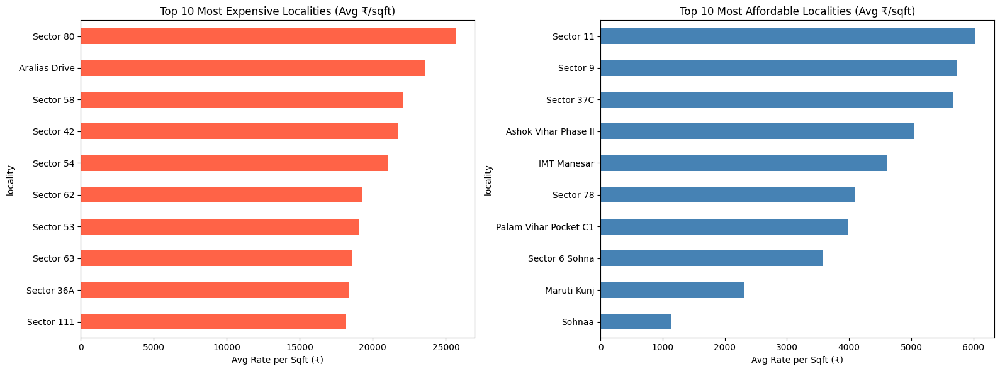

# Gurgaon Residential Real Estate Market Analysis

## 📌 Project Overview
This project performs an in-depth Exploratory Data Analysis (EDA) of 14,223 residential property listings in Gurgaon to uncover pricing patterns, locality-driven trends, and the impact of regulatory approval (RERA) on property valuation.

The goal is to transform raw listing data into actionable market insights for buyers and investors.

## 📊 Sample Visualization

---

## 🛠️ Tools & Technologies
- Python
- Pandas
- NumPy
- Matplotlib
- Seaborn
- Jupyter / Google Colab

---

## 📊 Key Analysis Performed

### ✅ Data Cleaning & Preprocessing
- Standardized column names
- Removed duplicates
- Converted string-based numeric columns
- Normalized categorical values
- Validated dataset consistency using calculated price-per-sqft

### ✅ Outlier Removal
- Applied IQR method on `rate_per_sqft`
- Removed 476 unrealistic property listings
- Final dataset: 13,747 properties

### ✅ Locality-Level Pricing Analysis
- Filtered localities with minimum 10 listings
- Identified an 8x price gap between premium and affordable sectors

### ✅ RERA Impact Analysis
- Compared median prices of RERA-approved vs non-approved properties
- Identified a 5.04% price premium for RERA-approved projects

### ✅ Correlation Analysis
- Strongest pricing driver: `rate_per_sqft` (r = 0.61)
- Moderate impact: Area (r = 0.30)
- Minimal impact: BHK count (r = 0.08)

---

## 📈 Key Insights

- Location is the strongest determinant of property pricing.
- RERA approval adds measurable value (~5% premium).
- Bedroom count alone does not significantly influence pricing.
- Area impacts total price, but locality drives valuation.

---

## 📂 Repository Structure
gurgaon-real-estate-analysis/
│
├── gurgaon_real_estate_analysis.ipynb
├── data/
├── images/
│   └── locality_price_comparison.png
└── README.md
---

## 🚀 Future Improvements
- Build predictive pricing model (Linear Regression / Random Forest)
- Add interactive dashboard (Streamlit / Power BI)
- Merge with additional datasets for premium locality coverage

---

## 👤 Author
Shambhavi Singh

If you found this project interesting, feel free to connect!
